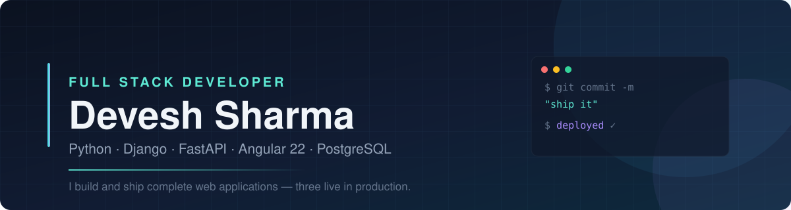

  
  
  
  

---

### 🛠 Tech I work with

**Backend**

  
  
  
  
  
  

**Frontend**

  
  
  
  
  

**Data & Infra**

  
  
  
  
  
  

---

## 🚀 What I've built

### 🧠 SmartHire ATS — Applicant Tracking System

> End-to-end hiring platform: job posting, application intake, AI resume screening, interview scheduling and offer tracking across admin, recruiter and candidate roles. An LLM layer parses resumes, extracts skills and scores each candidate against the job description, replacing manual shortlisting. Permissions are enforced server-side on every endpoint, closing privilege-escalation paths a UI-only check would leave open.

`Django` `DRF` `PostgreSQL` `LLM API` `Chart.js` `Render`

**[🔗 Live demo](LIVE-URL-SMARTHIRE)** &nbsp;·&nbsp; **[💻 Code](https://github.com/DeveshFullstack01/REPO-SMARTHIRE)**

---

### 🔧 FixIt — Apartment Maintenance Ticketing System

> Full-stack ticketing for residents, technicians and managers with JWT auth and role-scoped data access. SLA tracking uses lazy auto-escalation — breached tickets are re-prioritized on read, avoiding a separate scheduler process and its failure modes. Includes a per-ticket status timeline, in-app notifications, technician ratings and an analytics dashboard over aggregated queries.

`FastAPI` `SQLAlchemy 2.0` `Angular 22` `PostgreSQL (Neon)` `JWT` `Render` `Vercel`

**[🔗 Live demo](LIVE-URL-FIXIT)** &nbsp;·&nbsp; **[💻 Code](https://github.com/DeveshFullstack01/REPO-FIXIT)**

---

### 🍦 Ice Cream Paradise — API-First E-Commerce Storefront

> A Django REST backend exposing catalogue, category and filtering endpoints, consumed by a standalone Angular client deployed separately. Server-side filtering, search and pagination via django-filter so the frontend never over-fetches. Interactive OpenAPI docs via drf-spectacular, and idempotent slug-keyed seed migrations so catalogue data rebuilds correctly on every release.

`Django` `DRF` `Angular` `drf-spectacular` `Render` `Vercel`

**[🔗 Live demo](LIVE-URL-ICECREAM)** &nbsp;·&nbsp; **[💻 Code](https://github.com/DeveshFullstack01/icecream-project)**

---

### ⚡ Redis Clone — In-Memory Key-Value Store *(in progress)*

> Written from scratch in Python: an asyncio TCP server speaking the RESP wire protocol, with TTL expiry, LRU eviction and AOF persistence. Built to understand what actually happens below the client library.

`Python` `asyncio` `TCP` `RESP`

**[💻 Code](https://github.com/DeveshFullstack01/REDIS-CLONE)**

---

## 📈 Currently

- Extending the Redis clone — lists, sets and hashes next
- 100+ DSA problems solved on LeetCode and GeeksforGeeks
- **B.Tech, AI & ML** (2025) — LNCT Group of Colleges, Bhopal
- Open to **Software Engineer** roles

---

  
  

  

 

  <i>Thanks for stopping by — happy to talk about any of the above.</i>

